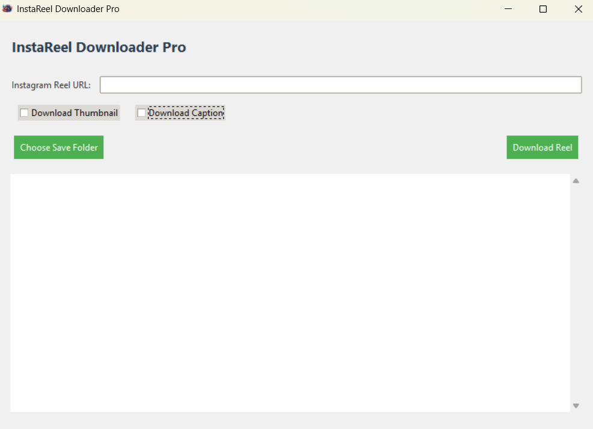

# Instagram-Media-Downloader v2.0.0

[](#) [](LICENSE)

<p align="center">
    
</p>

**Instagram-Media-Downloader** is a Python-based desktop application built with PyQt6 that enables users to download Instagram Reels along with their video, thumbnails, captions, and optional audio transcription.

## 🚀 Features

* Download Instagram Reels as **`.mp4`** files.
* Extract and save video thumbnails as **`.jpg`** files.
* Save captions as **`.txt`** files.
* Extract audio tracks as **`.mp3`** files.
* Optional transcription of audio to text using OpenAI Whisper.
* Responsive, user-friendly GUI built with **PyQt6**.
* Cross-platform support (Windows, macOS, Linux).
* Queue management for batch downloads with real-time progress.
* Session-based organization: downloads are grouped by timestamped session folders.



## 📂 Folder Structure

```plaintext
Instagram-Media-Downloader/
├── LICENSE                    # MIT License file
├── README.md                  # Project README (this file)
├── requirements.txt           # Python dependencies
├── src/                       # Source files
│   ├── main.py                # Application entry point
│   ├── favicon.ico            # App icon
│   └── ...                    # Other modules and resources
├── screenshots/               # UI screenshots
│   └── Interface.png          # Main interface example
└── downloads/                 # Auto-generated on first run
    └── session_YYYYMMDD_HHMMSS/
        ├── reel1/             # Folder per reel URL
        │   ├── video1.mp4
        │   ├── thumbnail1.jpg
        │   ├── caption1.txt
        │   ├── audio1.mp3
        │   └── transcript1.txt
        └── reel2/
            └── ...
```

## 🛠️ Installation

### Prerequisites

* Python 3.8 or higher
* `pip` package manager
* Git

### Steps

1. **Clone the repository**:

   ```bash
   git clone https://github.com/UKR-PROJECTS/Instagram-Media-Downloader.git
   cd Instagram-Media-Downloader
   ```
2. **Install dependencies**:

   ```bash
   pip install -r requirements.txt
   ```

> If `requirements.txt` is missing, manually install:
>
> ```bash
> pip install PyQt6 instaloader moviepy==1.0.3 openai-whisper requests pillow
> ```

## 💻 Usage

1. **Launch the application**:

   ```bash
   python src/main.py
   ```
2. **Add Reels**:

   * Paste one or more Instagram Reel URLs into the input field.
   * Click **Add to Queue**.
3. **Select Options**:

   * Video, Thumbnail, Caption, Audio, Transcription.
4. **Start Download**:

   * Click **Start Download** to begin.
   * Monitor progress in the **Queue** and **Results** tabs.
5. **Open Downloads**:

   * Click **Open Downloads** to browse downloaded files.

## 🏗️ Packaging as Executable

To create a standalone Windows executable (`.exe`) using **PyInstaller**, follow these steps:

1. **Install PyInstaller**:

   ```bash
   pip install pyinstaller
   ```

2. **Build the executable**:
   Execute the following command from the project root (where `src/main.py` resides):

   ```bash
   pyinstaller \
       --onefile \
       --windowed \
       --name InstagramMediaDownloader \
       --icon src/favicon.ico \
       --add-data "screenshots/Interface.png;screenshots" \
       --add-data "src/favicon.ico;." \
       src/main.py
   ```

   * `--onefile` bundles everything into a single `.exe`.
   * `--windowed` suppresses the console window (GUI only).
   * `--name` sets the executable name.
   * `--icon` specifies the application icon.
   * `--add-data` includes non-Python files; format is `source_path;destination_folder`.

3. **Locate the executable**:
   After a successful build, find `InstagramMediaDownloader.exe` in the `dist/` directory.

4. **Distribute**:

   * Copy `dist/InstagramMediaDownloader.exe` to your users.
   * Optionally include any required `downloads/` folder or dependencies.

## 🤝 Contributing

Contributions are welcome! To contribute:

1. Fork the repository
2. Create a new branch:

   ```bash
   git checkout -b feature/YourFeatureName
   ```
3. Commit your changes:

   ```bash
   git commit -m "Add some feature"
   ```
4. Push to the branch:

   ```bash
   git push origin feature/YourFeatureName
   ```
5. Open a Pull Request

## 📜 License

This project is licensed under the MIT License. See the [LICENSE](LICENSE) file for details.

## 🙏 Acknowledgments

* Built with [Instaloader](https://instaloader.github.io/) for media fetching.
* Uses [MoviePy](https://github.com/Zulko/moviepy) for audio/video processing.
* Integrates [OpenAI Whisper](https://github.com/openai/whisper) for transcription.
