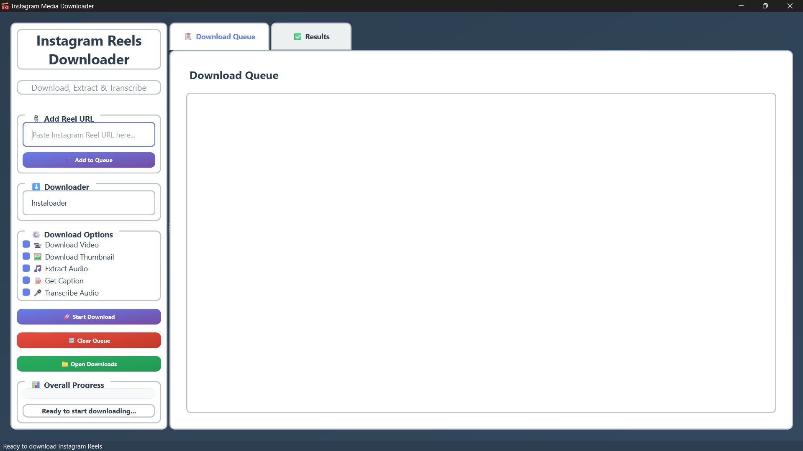

# 🚀 Instagram‑Media‑Downloader v2.0.1

  

<p align="center">
  
</p>

Instagram‑Media‑Downloader is a powerful, open‑source desktop application built with PyQt6 to download Instagram Reels—including video, thumbnail, caption, and audio—in one click with batch queue support and efficient performance.

---

## ✨ What’s New in v2.0.1

- ❌ Removed optional Whisper transcription feature  
- 🌀 Implemented lazy loading to reduce memory consumption  
- 🧼 Minor UI and stability improvements  

---

## 🛠️ All Features

- Download Instagram Reels as `.mp4`  
- Extract and save thumbnails as `.jpg`  
- Save captions as `.txt`  
- Extract audio tracks as `.mp3`  
- Session‑based folders timestamped on download  
- Batch queue management with progress bar  
- Lightweight & responsive PyQt6 GUI (Windows/macOS/Linux)  

---

## 🗂️ Folder Structure

```

Instagram-Media-Downloader/
├── LICENSE                      # MIT license
├── README.md                    # This file
├── requirements.txt             # Python dependencies
├── src/                         # Source code
│   ├── main.py                  # Entry point
│   └── favicon.ico              # App icon
├── screenshots/                 # UI screenshots
│   └── screenshot.png           # Example interface
└── downloads/                   # Created on first run
      └── session\_YYYYMMDD\_HHMMSS/
            ├── reel1/
            └── reel2/


---

## 📋 Requirements

- Python 3.8+  
- `pip` package manager  
- Git  

Install dependencies:

```bash
pip install -r requirements.txt
````

> Or manually:
>
> ```bash
> pip install PyQt6 instaloader moviepy==1.0.3 requests pillow
> ```

---

## ⚙️ Installation

1. **Clone** the repository:

   ```bash
   git clone https://github.com/UKR-PROJECTS/Instagram-Media-Downloader.git
   cd Instagram-Media-Downloader
   ```

2. **Install** Python dependencies:

   ```bash
   pip install -r requirements.txt
   ```

---

## ▶️ Usage

1. **Launch** the application:

   ```bash
   python src/main.py
   ```

2. **Add Reels**:

   * Paste one or more Instagram Reel URLs
   * Click **Add to Queue**

3. **Select Options**:

   * Choose Video, Thumbnail, Caption, Audio

4. **Start Download**:

   * Click **Start Download**
   * Monitor progress in the Queue & Results tabs

5. **Open Downloads**:

   * Click **Open Downloads** to browse saved files

---

## 📸 Screenshot



---

## 🤝 How to Contribute

1. **Fork** this repository
2. **Create** a feature branch:

   ```bash
   git checkout -b feature/YourFeatureName
   ```
3. **Commit** your changes:

   ```bash
   git commit -m "Describe your update"
   ```
4. **Push** and open a Pull Request:

   ```bash
   git push origin feature/YourFeatureName
   ```

---

## 🙏 Acknowledgments

* [Instaloader](https://github.com/instaloader/instaloader) for seamless media downloading
* [MoviePy](https://github.com/Zulko/moviepy) for audio/video processing
* [PyQt6](https://pypi.org/project/PyQt6/) for the GUI framework

## 🌟 Star History

If you find this project useful, please consider giving it a star on GitHub! Your support helps us continue improving and maintaining this tool.

## 📞 Support

- **GitHub Issues**: [Report bugs or request features](https://github.com/UKR-PROJECTS/Instagram-Media-Downloader/issues)
- **Discussions**: [Community discussions and Q&A](https://github.com/UKR-PROJECTS/Instagram-Media-Downloader/discussions)
- **Email**: ukrpurojekuto@gmail.com

---

<div align="center">

**Made with ❤️ by the Ujjwal Nova**

[⭐ Star this repo](https://github.com/UKR-PROJECTS/Instagram-Media-Downloader) | [🐛 Report Bug](https://github.com/UKR-PROJECTS/Instagram-Media-Downloader/issues) | [💡 Request Feature](https://github.com/UKR-PROJECTS/Instagram-Media-Downloader/issues)

</div>
