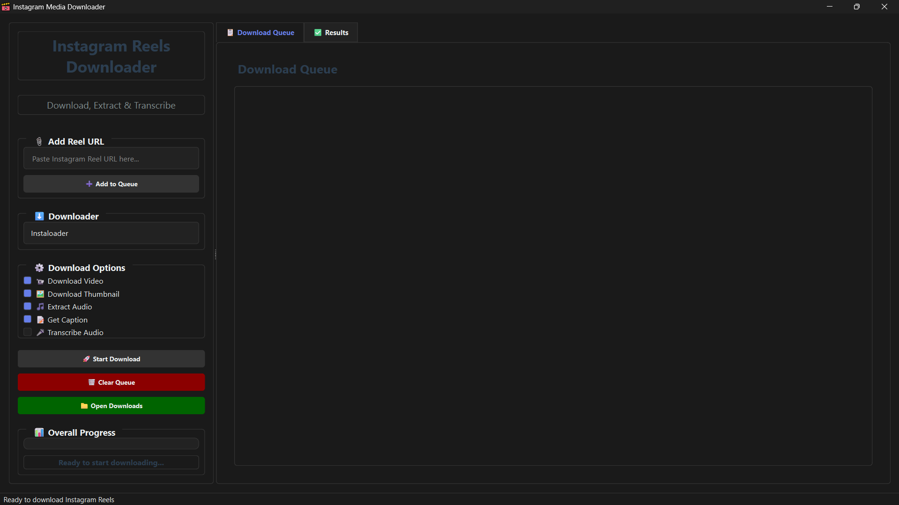

# 🚀 Instagram‑Media‑Downloader v2.0.0

  

<p align="center">
  
</p>

A simple desktop application built with PyQt6 to download Instagram Reels—including video, thumbnail, caption, audio, and optional transcription—in one click.

---

## ✨ What’s New in v2.0.0

- ✅ Added batch‑download queue with real‑time progress  
- ✅ Integrated OpenAI Whisper for optional audio transcription  
- ✅ Improved cross‑platform support and packaging scripts  
- ✅ Enhanced error handling and retry logic  

---

## 🛠️ All Features

- Download Instagram Reels as `.mp4`  
- Extract and save thumbnails as `.jpg`  
- Save captions as `.txt`  
- Extract audio tracks as `.mp3`  
- Optional audio‑to‑text transcription via Whisper  
- Session‑based folders timestamped on download  
- Batch queue management with progress bar  
- Responsive GUI built in PyQt6 (Windows/macOS/Linux)  

---

## 🗂️ Folder Structure

```

Instagram-Media-Downloader/
├── LICENSE                      # MIT license
├── README.md                    # This file
├── requirements.txt             # Python dependencies
├── src/                         # Source code
│   ├── main.py                  # Entry point
│   ├── favicon.ico              # App icon
│   └── ...                      # Other modules & resources
├── screenshots/                 # UI screenshots
│   └── Interface.png            # Example interface
└── downloads/                   # Created on first run
└── session\_YYYYMMDD\_HHMMSS/
├── reel1/
│   ├── video1.mp4
│   ├── thumbnail1.jpg
│   ├── caption1.txt
│   ├── audio1.mp3
│   └── transcript1.txt
└── reel2/
└── …

````

---

## 📋 Requirements

- Python 3.8+  
- `pip` package manager  
- Git  

Install dependencies via:

```bash
pip install -r requirements.txt
````

> If you prefer manual setup:
>
> ```bash
> pip install PyQt6 instaloader moviepy==1.0.3 openai-whisper requests pillow
> ```

---

## ⚙️ Installation

1. **Clone** the repo

   ```bash
   git clone https://github.com/UKR-PROJECTS/Instagram-Media-Downloader.git
   cd Instagram-Media-Downloader
   ```
2. **Install** dependencies

   ```bash
   pip install -r requirements.txt
   ```

---

## ▶️ Usage

1. **Launch** the app

   ```bash
   python src/main.py
   ```
2. **Add Reels**

   * Paste one or more Instagram Reel URLs
   * Click **Add to Queue**
3. **Select Options**

   * Choose Video, Thumbnail, Caption, Audio, Transcription
4. **Start Download**

   * Click **Start Download**
   * Monitor progress in the Queue & Results tabs
5. **Open Downloads**

   * Click **Open Downloads** to view files

---

## 📸 Screenshot



---

## 🤝 How to Contribute

1. **Fork** this repository
2. **Create** a feature branch

   ```bash
   git checkout -b feature/YourFeatureName
   ```
3. **Commit** your changes

   ```bash
   git commit -m "Add awesome feature"
   ```
4. **Push** to your branch

   ```bash
   git push origin feature/YourFeatureName
   ```
5. **Open** a Pull Request and describe your changes

---

## 🙏 Acknowledgments

* [Instaloader](https://github.com/instaloader/instaloader) for seamless media fetching
* [MoviePy](https://github.com/Zulko/moviepy) for audio/video processing
* [OpenAI Whisper](https://github.com/openai/whisper) for powerful transcription

