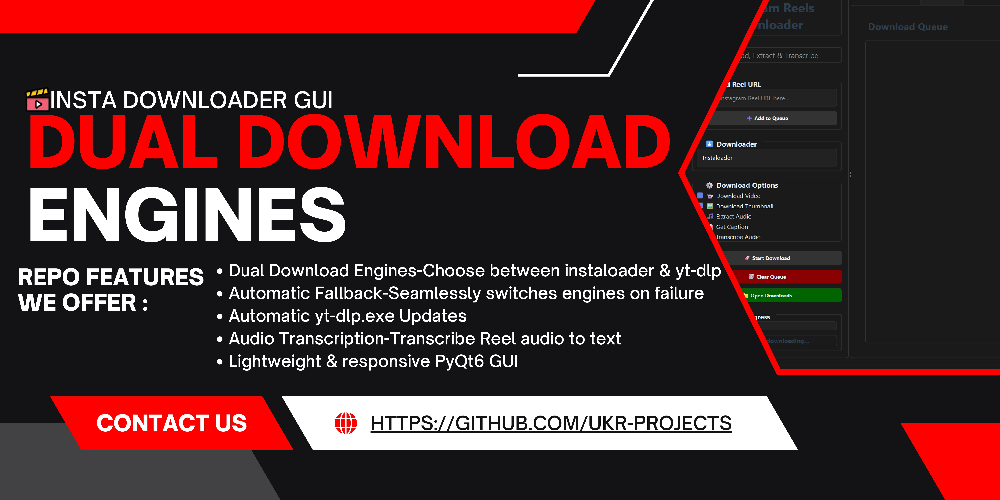

<h1>
  
  insta-downloader-gui
</h1>

[](LICENSE)
[](STATUS.md)
[](CHANGELOG.md)


<div align="center">
  
</div>

<div align="center">
  
</div>

---
## 🖼 Screenshot

<div align="center">
  
  <p><em>GUI Interface</em></p>
</div>

---

## ✨ What’s New in v1.0.0

- 🎉 **Initial release** with core download and UI functionality  
- **Dual Download Engines**: Now powered by both `instaloader` and `yt-dlp`.
- **User-Selectable Downloader**: Choose your preferred download engine from the UI.
- **Automatic Fallback**: If one downloader fails, the app automatically switches to the other to ensure success.
- **Enhanced Reliability**: Improved download success rates for a wider range of Reels.

---

## 🛠️ All Features

- **Dual Download Engines**: Choose between `instaloader` and `yt-dlp`.
- **Automatic Fallback**: Seamlessly switches engines on failure.
- **Automatic yt-dlp Updates**: Checks for and installs the latest version of yt-dlp.
- **Audio Transcription**: Transcribe Reel audio to text using the included OpenAI Whisper model (base.pt) with support for multilingual transcription.
- Download Instagram Reels as `.mp4`.
- Extract and save thumbnails as `.jpg`.
- Save captions as `.txt`.
- Extract audio tracks as `.mp3`.
- Session-based folders timestamped on download.
- Batch queue management with progress bar.
- Lightweight & responsive PyQt6 GUI (Windows/macOS/Linux).

---

## 🗂️ Folder Structure

```

```

---

## 🕹 Usage

### Prerequisites

- GitHub

### Installation

```bash
# Clone the repository
git clone https://github.com/uikraft-hub/insta-downloader-gui.git
```

For more detailed documentation, see our [USAGE.md](USAGE.md)

---

## 🤝 Contributing

Please see our [Contributing Guide](CONTRIBUTING.md) for details.

---

### Code of Conduct

This project follows our [Code of Conduct](CODE_OF_CONDUCT.md). Please read it before contributing.

---

## 📋 Roadmap

- [x] Lightweight & responsive
- [x] Initial release
- [x] Dual Download Engines

See the [open issues](https://github.com/uikraft-hub/insta-downloader-gui/issues) for a full list of proposed features and known issues.

---

## 📝 Changelog

All notable changes to this project are documented in [CHANGELOG.md](CHANGELOG.md).

---

## 📄 License

This project is licensed under the MIT License - see the [LICENSE](../LICENSE) file for details.

---


## 🙏 Acknowledgments

* [Instaloader](https://github.com/instaloader/instaloader) for seamless media downloading
* [yt-dlp](https://github.com/yt-dlp/yt-dlp) for robust video downloading
* [MoviePy](https://github.com/Zulko/moviepy) for audio/video processing
* [PyQt6](https://pypi.org/project/PyQt6/) for the GUI framework

---

## 📞 Support

- 📧 Email: ujjwalkrai@gmail.com
- 🐛 Issues: [Repo Issues](https://github.com/uikraft-hub/insta-downloader-gui/issues)
- 🔓 Security: [Repo Security](https://github.com/uikraft-hub/insta-downloader-gui/security)
- ⛏ Pull Request: [Repo Pull Request](https://github.com/uikraft-hub/insta-downloader-gui/pulls)
- 📖 Docs: [Repo Documentation](https://github.com/uikraft-hub/insta-downloader-gui/tree/main/docs)
- 📃 Changelog: [Repo Changelog](https://github.com/uikraft-hub/insta-downloader-gui/docs/CHANGELOG.md)
---

## 🔗 Connect

#### 📝 Writing & Blogging
[](https://ukr-projects.hashnode.dev/)
[](https://medium.com/@ukrpurojekuto)

#### 💼 Professional
[](https://ukr-projects.github.io/ukr-projects/)
[](https://github.com/ukr-projects)
[](https://github.com/cyberx-projects)
[](https://github.com/contro-projects)
[](https://www.linkedin.com/in/u-k-r/ )
[](https://www.youtube.com/@ujjwal-krai)

#### 🌐 Social
[](https://x.com/ukr_projects)
[](https://www.instagram.com/ukr_projects)
[](https://www.youtube.com/@ukr-projects)
[](https://t.me/ukr_projects)
[](https://www.reddit.com/user/mrujjwalkr)

---

<div align="center">
  Made with ❤️ by <a href="https://github.com/ukr-projects">ukr</a>
</div>

---
